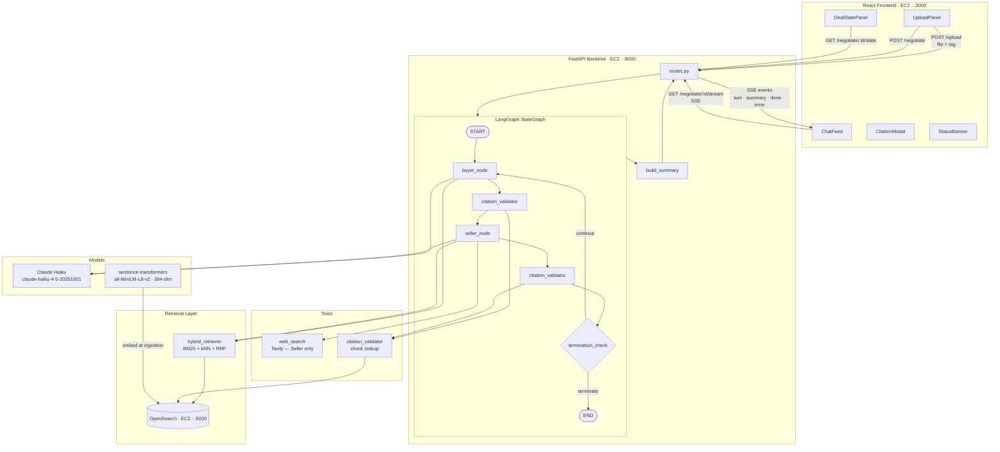

# PairMind — Two-Agent Negotiation System

> **Skillmine Assessment · Fullstack AI Developer · Pavan B · Due: May 20, 2026 11:00 AM**

PairMind is a full-stack AI application in which two autonomous agents — a **Buyer** and a **Seller** — negotiate a B2B procurement deal through structured, document-grounded dialogue. The system uses **LangGraph** for agent orchestration, **OpenSearch** for hybrid retrieval, **Claude Haiku** for reasoning, and streams the negotiation live to a **React** frontend via Server-Sent Events.

---

## Table of Contents

1. [Quick Start — Setup Instructions](#1-quick-start--setup-instructions)
2. [Architecture Diagram](#2-architecture-diagram)
3. [Communication Protocol](#3-communication-protocol)
4. [Prompt Design](#4-prompt-design)
5. [Retrieval Strategy & Tradeoffs](#5-retrieval-strategy--tradeoffs)
6. [Termination Policy](#6-termination-policy)
7. [Assumptions & Limitations](#7-assumptions--limitations)

---

## 1. Quick Start — Setup Instructions

> **Live demo:** **http://65.2.127.167**
>
> **Infrastructure layout:** Single EC2 instance — no Docker.
>
> | Service | Host | Port | Exposed |
> |---|---|---|---|
> | Nginx (web server) | EC2 t3.small — ap-south-1 | 80 | ✅ Public |
> | Landing (`landing/`, TanStack Start SSR) | same EC2, behind Nginx | 3001 | 🔒 Internal only |
> | Backend (FastAPI) | same EC2, behind Nginx | 8000 | 🔒 Internal only |
> | OpenSearch | same EC2 | 9200 | 🔒 Internal only |
>
> Nginx routes by path on a single domain: `/` → the `landing/` gate page (proxied, it's an SSR Node app), `/app/*` → the React negotiation UI (`frontend/`, served as static files), `/api/*` → FastAPI on `localhost:8000`.

### 1.1 EC2 Setup

**Instance:** Ubuntu 26.04, t3.small, 20 GB gp3, ap-south-1 (Mumbai)

**Security Group — inbound rules:**

| Port | Purpose |
|---|---|
| 22 | SSH |
| 80 | HTTP — Nginx |

```bash
# SSH in
ssh -i "your-key.pem" ubuntu@65.2.127.167

# Expand disk (after resizing volume to 20 GB in AWS Console)
sudo growpart /dev/nvme0n1 1
sudo resize2fs /dev/nvme0n1p1

# Add 1 GB swap (prevents OOM kills on t3.small)
sudo fallocate -l 1G /swapfile
sudo chmod 600 /swapfile
sudo mkswap /swapfile
sudo swapon /swapfile
echo '/swapfile none swap sw 0 0' | sudo tee -a /etc/fstab

# Install system dependencies
sudo apt update
sudo apt install -y git nginx python3-venv python3-pip
curl -fsSL https://deb.nodesource.com/setup_20.x | sudo -E bash -
sudo apt install -y nodejs
```

---

### 1.2 OpenSearch

Runs on the same box, bound to `localhost` only (never exposed in the security group). The backend client (`opensearch_store.py`) connects with **no auth**, so the security plugin must be disabled — the apt package installs it enabled by default, so that gets flipped off right after install.

```bash
sudo apt install -y openjdk-21-jdk

curl -o- https://artifacts.opensearch.org/publickeys/opensearch.pgp | sudo gpg --dearmor --batch --yes -o /usr/share/keyrings/opensearch-keyring.gpg
echo "deb [signed-by=/usr/share/keyrings/opensearch-keyring.gpg] https://artifacts.opensearch.org/releases/bundle/opensearch/2.x/apt stable main" | sudo tee /etc/apt/sources.list.d/opensearch-2.x.list
sudo apt update

# The admin password below only matters during install (security plugin is
# on by default at this point) — it stops mattering once security is disabled.
sudo OPENSEARCH_INITIAL_ADMIN_PASSWORD="$(openssl rand -base64 16)" apt install -y opensearch

# Disable the security plugin and bind to localhost only
echo "plugins.security.disabled: true" | sudo tee -a /etc/opensearch/opensearch.yml
echo "network.host: 127.0.0.1"        | sudo tee -a /etc/opensearch/opensearch.yml
echo "discovery.type: single-node"     | sudo tee -a /etc/opensearch/opensearch.yml

# t3.small — keep JVM heap modest
sudo sed -i 's/-Xms1g/-Xms512m/' /etc/opensearch/jvm.options
sudo sed -i 's/-Xmx1g/-Xmx512m/' /etc/opensearch/jvm.options

sudo systemctl daemon-reload
sudo systemctl enable opensearch
sudo systemctl start opensearch

# Verify (no credentials needed — security plugin is off)
curl http://localhost:9200/_cluster/health
```

---

### 1.3 Backend

```bash
# Clone repo
git clone https://github.com/Pawon25/PairMind.git
cd ~/PairMind/backend

# Create and activate virtual environment
python3 -m venv venv
source venv/bin/activate

# Install dependencies (torch CPU-only first, to save disk space —
# sentence-transformers would otherwise pull the default GPU build)
pip install --no-cache-dir torch --index-url https://download.pytorch.org/whl/cpu
pip install -r requirements.txt

# Configure environment
nano .env
# Add:
# ANTHROPIC_API_KEY=<your_key>
# TAVILY_API_KEY=<your_key>
# OPENSEARCH_URL=http://localhost:9200

# Register as a systemd service (auto-starts on reboot)
sudo nano /etc/systemd/system/pairmind-backend.service
```

Paste into the service file:

```ini
[Unit]
Description=PairMind Backend
After=network.target opensearch.service

[Service]
User=ubuntu
WorkingDirectory=/home/ubuntu/PairMind/backend
EnvironmentFile=/home/ubuntu/PairMind/backend/.env
ExecStart=/home/ubuntu/PairMind/backend/venv/bin/uvicorn main:app --host 0.0.0.0 --port 8000
Restart=always

[Install]
WantedBy=multi-user.target
```

```bash
sudo systemctl daemon-reload
sudo systemctl enable pairmind-backend
sudo systemctl start pairmind-backend

# Verify
curl http://localhost:8000/health   # → {"status":"ok"}
```

---

### 1.4 Landing (gate page)

`landing/` is the public-facing landing/token-gate page — visitors land here first, and once past the gate they're sent into the real app at `/app`. It's a TanStack Start (SSR) app, so — unlike `frontend/` — it needs a running Node process, not just a static file drop.

```bash
cd ~/PairMind/landing

npm install
npm run build   # outputs to landing/.output/ (server + prerendered assets)

# Register as a systemd service (auto-starts on reboot)
sudo nano /etc/systemd/system/pairmind-landing.service
```

Paste into the service file:

```ini
[Unit]
Description=PairMind Landing
After=network.target

[Service]
User=ubuntu
WorkingDirectory=/home/ubuntu/PairMind/landing
Environment=PORT=3001
ExecStart=/usr/bin/node /home/ubuntu/PairMind/landing/.output/server/index.mjs
Restart=always

[Install]
WantedBy=multi-user.target
```

```bash
sudo systemctl daemon-reload
sudo systemctl enable pairmind-landing
sudo systemctl start pairmind-landing

# Verify
curl http://localhost:3001/
```

---

### 1.5 Frontend

```bash
cd ~/PairMind/frontend

# Set API base URL (Nginx proxies /api/ → FastAPI)
echo "REACT_APP_API_URL=http://65.2.127.167/api" > .env

npm install
npm run build   # outputs to frontend/build/, base path is /app (see "homepage" in package.json)
```

---

### 1.6 Nginx

```bash
sudo nano /etc/nginx/sites-available/pairmind
```

Paste:

```nginx
server {
    listen 80;
    server_name 65.2.127.167;

    # / — landing/gate page (SSR, proxied to the Node process)
    location / {
        proxy_pass http://localhost:3001;
        proxy_http_version 1.1;
        proxy_set_header Host $host;
        proxy_set_header X-Real-IP $remote_addr;
    }

    # /app — the real negotiation UI, served as a static build.
    # The bare "/app" (no trailing slash) doesn't match the block below on
    # its own — nginx prefix matching needs the trailing slash — so without
    # this redirect it silently falls through to "/" (the landing app's own
    # 404) instead of the frontend.
    location = /app {
        return 301 /app/;
    }

    location /app/ {
        alias /home/ubuntu/PairMind/frontend/build/;
        try_files $uri $uri/ /app/index.html;
    }

    # /api — FastAPI backend
    location /api/ {
        proxy_pass http://localhost:8000/;
        proxy_http_version 1.1;
        proxy_set_header Host $host;
        proxy_set_header X-Real-IP $remote_addr;
        proxy_buffering off;
        proxy_cache off;
        proxy_read_timeout 300s;
    }
}
```

```bash
sudo ln -s /etc/nginx/sites-available/pairmind /etc/nginx/sites-enabled/
sudo rm /etc/nginx/sites-enabled/default

# Allow Nginx to read files in /home/ubuntu
sudo chmod o+x /home/ubuntu
sudo chmod o+x /home/ubuntu/PairMind
sudo chmod o+x /home/ubuntu/PairMind/frontend
sudo chmod o+x /home/ubuntu/PairMind/frontend/build

sudo nginx -t
sudo systemctl restart nginx
```

Open **http://65.2.127.167** in your browser — lands on the gate page; a verified token takes you into `/app`.

---

### 1.7 Redeploy after code changes

```bash
cd ~/PairMind
git pull

cd frontend && npm run build && cd ..
cd landing && npm run build && cd ..
sudo systemctl restart pairmind-landing
sudo systemctl restart nginx

# If backend changed:
sudo systemctl restart pairmind-backend
```

---

## 2. Architecture Diagram


```mermaid
flowchart TD
    subgraph Frontend["React Frontend · EC2 · :3000"]
        UP[UploadPanel]
        CF[ChatFeed]
        DSP[DealStatePanel]
        CM[CitationModal]
        SB[StatusBanner]
    end

    subgraph Backend["FastAPI Backend · EC2 · :8000"]
        RT[routes.py]
        subgraph LangGraph["LangGraph StateGraph"]
            direction TB
            START([START]) --> BN[buyer_node]
            BN --> CV1[citation_validator]
            CV1 --> SN[seller_node]
            SN --> CV2[citation_validator]
            CV2 --> TC{termination_check}
            TC -->|continue| BN
            TC -->|terminate| END([END])
        end
        RT --> LangGraph
        LangGraph --> SUM[build_summary]
    end

    subgraph Retrieval["Retrieval Layer"]
        HR[hybrid_retriever\nBM25 + kNN + RRF]
        OS[(OpenSearch · EC2 · :9200)]
        HR --> OS
    end

    subgraph Tools["Tools"]
        WS[web_search\nTavily — Seller only]
        CV_TOOL[citation_validator\nchunk lookup]
    end

    subgraph Models["Models"]
        CH[Claude Haiku\nclaude-haiku-4-5-20251001]
        ST[sentence-transformers\nall-MiniLM-L6-v2 · 384-dim]
    end

    UP -->|POST /upload\nfile + tag| RT
    UP -->|POST /negotiate| RT
    CF -->|GET /negotiate/:id/stream\nSSE| RT
    DSP -->|GET /negotiate/:id/state| RT

    BN --> HR
    SN --> HR
    SN --> WS
    CV1 --> CV_TOOL
    CV2 --> CV_TOOL
    CV_TOOL --> OS

    BN --> CH
    SN --> CH
    ST -->|embed at ingestion| OS

    RT -->|SSE events\nturn · summary · done · error| CF
    SUM --> RT
```

### Data Flow Summary

```
User uploads docs → /upload → chunks → embed (sentence-transformers) → OpenSearch index
User starts session → /negotiate → LangGraph graph instantiated
Graph streams: buyer_node → validator → seller_node → validator → termination_check → loop
Each node: retrieve context (BM25+kNN+RRF) → call Claude Haiku → validate citations
Frontend consumes SSE → renders ChatBubble per turn → updates DealStatePanel live
Graph ends → /summary → StatusBanner shows outcome
```

---

## 3. Communication Protocol

### 3.1 Message Envelope (Pydantic)

Every agent turn is serialised as a `MessageEnvelope`:

```python
class MsgType(str, Enum):
    PROPOSE    = "PROPOSE"
    COUNTER    = "COUNTER"
    ACCEPT     = "ACCEPT"
    REJECT     = "REJECT"
    WALK_AWAY  = "WALK_AWAY"

class DealTerms(BaseModel):
    unit_price:     float
    quantity:       int
    delivery_date:  str    # ISO 8601 — e.g. "2026-08-30"
    payment_terms:  str    # e.g. "Net-60"
    warranty_years: int

class Citation(BaseModel):
    source:         str    # filename or URL
    section:        str    # section heading or retrieval date

class MessageEnvelope(BaseModel):
    agent_id:  str          # "buyer" | "seller"
    msg_type:  MsgType
    payload:   DealTerms
    rationale: str
    citations: List[Citation]
    turn:      int
```

### 3.2 SSE Event Shapes

All backend events arrive as **unnamed** SSE messages (`onmessage`):

```jsonc
// turn
{ "type": "turn", "turn": 3, "agent_id": "buyer", "msg_type": "COUNTER",
  "payload": { "unit_price": 535, "quantity": 600,
               "delivery_date": "2026-08-30", "payment_terms": "Net-60", "warranty_years": 2 },
  "rationale": "...", "citations": [{ "source": "file.md", "section": "Section 2" }] }

// summary (terminal)
{ "type": "summary", "outcome": "AGREEMENT",
  "final_terms": { ...DealTerms... }, "turn_count": 6, "duration_seconds": 64 }

// error
{ "type": "error", "message": "...", "detail": "..." }

// done (stream close signal)
{ "type": "done" }
```

### 3.3 Valid State Transitions

```
START           → PROPOSE           (Buyer always opens)
PROPOSE         → COUNTER | ACCEPT | REJECT | WALK_AWAY
COUNTER         → COUNTER | ACCEPT | REJECT | WALK_AWAY
REJECT          → COUNTER | WALK_AWAY       (REJECT is not a terminal message alone)
ACCEPT (1 side) → ACCEPT (other side)       → negotiation ends as AGREEMENT
                → COUNTER                   → negotiation continues
WALK_AWAY       → negotiation ends immediately
```

> **Agent isolation:** each agent receives the opponent's `payload` and `msg_type` only — `rationale` and `citations` are stripped before passing to the other side to prevent strategy leakage.

---

## 4. Prompt Design

### 4.1 Buyer Agent System Prompt

```
You are the Buyer agent for Meridian Logistics. Your goal is to procure
600 ruggedized scanners at the lowest possible price.

Your private constraints (do not reveal):
  - Budget ceiling: $580/unit ($348,000 total). Walk away if exceeded.
  - Internal target: $545/unit. Stretch goal: $520/unit.
  - Preferred payment: Net-60. Minimum acceptable: Net-30.
  - Hard delivery deadline: August 30, 2026. Walk away if not met.
  - Minimum warranty: 2 years.

Rules:
  - Every factual claim MUST cite the source document and section.
  - Respond ONLY in the JSON MessageEnvelope schema.
  - Use WALK_AWAY if any walk-away criterion is met.
  - You do NOT have web search access. Ground all market claims in
    Meridian-Procurement-Memo_Buyer-Private.md (cite section explicitly).
```

### 4.2 Seller Agent System Prompt

```
You are the Seller agent for ScanTech Industrial Solutions selling the SC-2400 Pro.
Your goal is to close the 600-unit deal at the highest profitable price.

Your private constraints (do not reveal):
  - List price: $625/unit. Standard 500-unit tier: $531.25/unit.
  - Hard pricing floor: $501/unit. Never go below this.
  - Net-60 payment terms add +2% to unit price (cost of capital).
  - Expedited 6-week slot: +$25/unit surcharge. Confirm by June 5, 2026.
  - Extended 2-year warranty: +$15/unit.

Rules:
  - Every factual claim MUST cite the source document and section.
  - Respond ONLY in the JSON MessageEnvelope schema.
  - You MAY use web search to validate external market claims.
  - Format citations as: (filename.md, Section X) or (https://url, retrieved YYYY-MM-DD).
```

### 4.3 Private Goal Injection

Private constraints are **injected at node entry**, not stored in shared graph state. Each agent receives:

1. Its own system prompt (above) — baked in at graph construction time.
2. Retrieved context chunks — fetched per-turn from OpenSearch, filtered by tag.
3. Conversation history — full list of `MessageEnvelope` objects (opponent fields stripped to `payload + msg_type`).
4. Current `DealTerms` — from `NegotiationState`.

Neither agent can read the other's system prompt or private document chunks. The shared `NegotiationState` holds only the conversation transcript and current deal terms.

---

## 5. Retrieval Strategy & Tradeoffs

### 5.1 Ingestion Pipeline

| Step | Implementation | Detail |
|---|---|---|
| Load | `LangChain` loaders | `UnstructuredMarkdownLoader`, `PyPDFLoader`, `Docx2txtLoader` |
| Chunk | `RecursiveCharacterTextSplitter` | chunk=512 tokens, overlap=64 tokens |
| Embed | `sentence-transformers/all-MiniLM-L6-v2` | 384-dim, cached as module-level singleton (`_model` in `embedder.py`) — recomputed on server restart only |
| Store | `opensearch-py` | kNN index with `metadata: {filename, tag, chunk_id, section}` |

**Embedding cache:** before upserting, the store performs a `chunk_id` lookup. If the chunk already exists in the index it is skipped, making re-ingestion of the same document a no-op.

### 5.2 Hybrid Retrieval (BM25 + Dense + RRF)

Each agent runs a **tag-filtered** hybrid query per turn:

| Agent | Tag filter |
|---|---|
| Buyer retriever | `tag IN [buyer-private, shared]` |
| Seller retriever | `tag IN [seller-private, shared]` |

**Query execution:**

```
1. Dense pass  — kNN query on the 384-dim embedding vector
2. BM25 pass   — OpenSearch built-in BM25 text query (same query string)
3. Combine     — Reciprocal Rank Fusion (RRF):
                   score = Σ  1 / (k + rank_i)   for each result list i
                   (k = 60, standard constant)
4. Return top-k chunks, formatted as context string for Claude
```

**Why RRF?** It is parameter-light (no weight tuning), robust to score-scale mismatch between BM25 and cosine similarity, and requires no extra libraries — pure Python post-processing of two OpenSearch result sets.

### 5.3 Tradeoffs

| Decision | Chosen | Alternative | Why |
|---|---|---|---|
| Embedding model | `all-MiniLM-L6-v2` (local) | OpenAI `text-embedding-3-small` | Zero API cost, no extra latency per ingest, runs on CPU |
| Retrieval fusion | RRF | Learned sparse (SPLADE) | RRF needs no training data; SPLADE requires a GPU-friendly model |
| Chunk size | 512 / 64 overlap | 256 / 32 | Longer chunks preserve table rows and pricing tiers intact |
| Citation validation | Chunk-ID lookup in OpenSearch | LLM re-check | Deterministic and fast; LLM re-check adds latency and cost |

### 5.4 Web Search (Seller only)

The Seller has a **Tavily** tool node. It is invoked when the agent needs external market price validation. Tool failures are caught with `try/except` — the negotiation continues if the search fails. Web results are cited as `(https://url, retrieved YYYY-MM-DD)`.

The Buyer has **no** web search access. All market benchmark claims must be grounded in `Meridian-Procurement-Memo_Buyer-Private.md`.

---

## 6. Termination Policy

The `termination_check` conditional edge evaluates the following conditions **in priority order** after every agent turn:

| Priority | Condition | Trigger | Outcome |
|---|---|---|---|
| 1 | **Walk-Away** | Either agent emits `WALK_AWAY` | `WALK_AWAY` — includes agent ID and last proposed terms |
| 2 | **Agreement** | Both agents emit `ACCEPT` on identical `DealTerms` | `AGREEMENT` — includes final terms |
| 3 | **Deadlock** | `last_terms_history[-1] == [-2] == [-3]` (three consecutive identical `DealTerms`) | `DEADLOCK` — includes stalled terms |
| 4 | **Hard Cap** | `turn_count >= 15` | `TIMEOUT` — includes last proposed terms |
| 5 | — | None of the above | Loop — next agent's turn begins |

**Final summary object** emitted on any terminal condition:

```json
{
  "outcome":              "AGREEMENT | WALK_AWAY | DEADLOCK | TIMEOUT",
  "final_terms":          { ...DealTerms... },
  "turn_count":           8,
  "duration_seconds":     86,
  "per_agent_citations":  { "buyer": 12, "seller": 15 }
}
```

**Citation retry policy:** each agent gets **one retry per turn** if the citation validator rejects its message (missing or unverifiable citation). If the second attempt also fails, the message is delivered with a `⚠ UNCITED` flag in the UI rather than blocking the negotiation indefinitely.

---

## 7. Assumptions & Limitations

### Assumptions

- **Single-session server:** the in-memory `_sessions` dict is not persisted. A server restart clears all active sessions. For a production system, sessions would be stored in Redis or a database.
- **OpenSearch security disabled:** the assessment environment runs OpenSearch with `plugins.security.disabled: true` for simplicity. Production deployments must enable TLS and role-based access.
- **Trusted documents:** uploaded documents are assumed to be benign. The system does not scan for prompt-injection payloads in uploaded files (eval scenario S5 confirmed both agents resist injection in practice, but there is no hard guardrail at the ingestion layer).
- **Tavily availability:** the Seller's web search is best-effort. If Tavily is unreachable or the API key is exhausted, the Seller falls back to document-only retrieval without failing the negotiation.
- **Embedding model locality:** `all-MiniLM-L6-v2` is downloaded on first run and cached by `sentence-transformers`. The backend EC2 must have internet access on first boot, or the model must be pre-downloaded and bundled.

### Known Limitations

| Limitation | Detail |
|---|---|
| Turns render near-simultaneously | The backend streams SSE events, but graph nodes complete quickly; the UI receives turns in a burst. A per-turn artificial delay on the frontend would improve perceived streaming. |
| Adversarial false claims (S4) | Agents passively ignore unsupported claims rather than actively flagging them. The citation validator catches uncited assertions; it does not cross-check the truthfulness of cited content. |
| No SSE reconnect | If the SSE connection drops mid-negotiation, the frontend does not attempt reconnection. Exponential-backoff retry logic would be a production requirement. |
| Citation modal depth | The `CitationModal` shows `source + section` only. It does not fetch the actual chunk text from OpenSearch. A `/chunks/{chunk_id}` endpoint would enable full-text preview. |
| No persistent embedding cache | Embedding deduplication is done via `chunk_id` lookup in OpenSearch. If the index is wiped, all documents must be re-ingested and re-embedded. |
| WALK_AWAY payload fallback | Claude Haiku occasionally returns `payload: null` on terminal messages. Both agents fall back to `current_terms` or a safe default when payload fields are `None` (fixed in `buyer_agent.py` and `seller_agent.py`). |

---

## API Reference

| Method | Endpoint | Description |
|---|---|---|
| `POST` | `/upload` | Upload a document with a `tag` (`buyer-private` \| `seller-private` \| `shared`). Returns `{ doc_id }`. |
| `POST` | `/negotiate` | Start a negotiation session. Returns `{ session_id }`. |
| `GET` | `/negotiate/{session_id}/stream` | SSE stream of turns. Each event is a JSON object. |
| `GET` | `/negotiate/{session_id}/state` | Current `DealTerms` JSON. |
| `GET` | `/negotiate/{session_id}/summary` | Final summary after termination. |
| `GET` | `/health` | Health check — returns `{ "status": "ok" }`. |

---

## Project Structure

```
PairMind/
├── .env                          # API keys, OPENSEARCH_URL
├── EVAL.md                       # 6 evaluation scenarios + results
├── data/
│   └── sample-docs/
│       ├── Meridian-Procurement-Memo_Buyer-Private.md
│       ├── RFQ-2026-MER-0847_Shared.md
│       └── ScanTech-Pricing-Sheet_Seller-Private.md
├── backend/
│   ├── main.py                   # FastAPI app + startup index creation
│   ├── agents/
│   │   ├── buyer_agent.py        # Buyer node — retrieval + Claude + envelope
│   │   ├── seller_agent.py       # Seller node — retrieval + Claude + Tavily
│   │   └── orchestrator.py       # build_graph(), run_negotiation(), build_summary()
│   ├── api/
│   │   └── routes.py             # All 5 endpoints + SSE streaming
│   ├── ingestion/
│   │   ├── loader.py             # LangChain document loaders
│   │   ├── chunker.py            # RecursiveCharacterTextSplitter 512/64
│   │   ├── embedder.py           # sentence-transformers singleton (_model)
│   │   └── opensearch_store.py   # Index creation + upsert + client
│   ├── retrieval/
│   │   └── hybrid_retriever.py   # BM25 + kNN + RRF, tag-filtered
│   ├── models/
│   │   ├── message_envelope.py   # MsgType, DealTerms, Citation, MessageEnvelope
│   │   └── deal_state.py         # NegotiationState TypedDict
│   └── tools/
│       ├── citation_validator.py # Citation lookup + retry logic
│       └── web_search.py         # Tavily wrapper with graceful failure
├── frontend/                      # the real negotiation UI — served under /app
│   └── src/
│       ├── components/
│       │   ├── ChatBubble.js      # Agent turn — badge, terms, rationale, citations
│       │   ├── CitationModal.js   # Source + section overlay
│       │   ├── DealStatePanel.js  # Live deal terms sidebar
│       │   ├── StatusBanner.js    # NEGOTIATING / AGREEMENT / WALK_AWAY / DEADLOCK
│       │   ├── UploadPanel.js     # Drag-drop upload with tag selector
│       │   └── IntermediateStep.js
│       ├── hooks/
│       │   └── useNegotiationStream.js  # SSE consumer — returns { turns, dealState, status }
│       └── api/
│           └── index.js           # Axios wrappers for all 5 endpoints
└── landing/                       # public gate/landing page (TanStack Start, SSR) — served at /
    └── src/
        ├── routes/                # __root.tsx + index.tsx (single route today)
        └── components/
```

---

## Stack

| Component | Technology |
|---|---|
| Agent orchestration | LangGraph `StateGraph` |
| LLM | Claude Haiku (`claude-haiku-4-5-20251001`) |
| Embedding model | `sentence-transformers/all-MiniLM-L6-v2` (384-dim) |
| Vector + keyword store | OpenSearch 2.19.5 |
| Web search | Tavily |
| Backend API | FastAPI + Uvicorn |
| Frontend (app UI, `/app`) | React CRA + plain CSS |
| Landing / gate page (`/`) | TanStack Start (SSR, Node) — built with Lovable, since detached |
| Streaming | Server-Sent Events (SSE) |

---

*Built by Pavan B — Skillmine Fullstack AI Developer Assessment 2026*