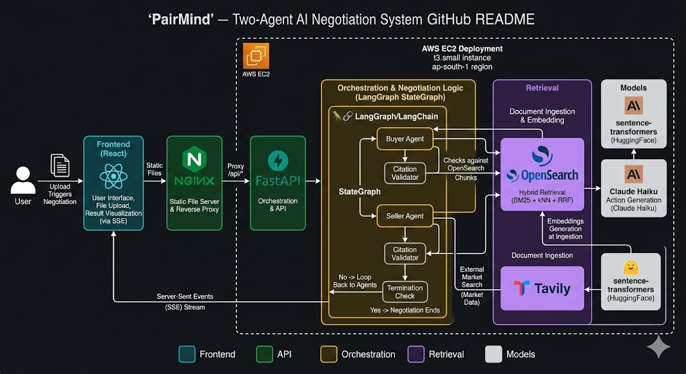

# PairMind — Two-Agent Negotiation System

PairMind is a full-stack AI application in which two autonomous agents — a **Buyer** and a **Seller** — negotiate a B2B procurement deal through structured, document-grounded dialogue. Each agent only knows what's in its own uploaded documents, every factual claim it makes has to cite a real section of a real document, and the negotiation always resolves to exactly one of four outcomes. The system uses **LangGraph** for agent orchestration, **OpenSearch** for hybrid retrieval, **Claude Haiku** for reasoning, and streams the negotiation live to a **React** frontend via Server-Sent Events.

> **Live demo:** **https://pairmind.pavanb.in** — invite-only (see [Access Model](#6-access-model)); full deployment steps live in [`docs/PairMind_Deployment_Guide.md`](docs/PairMind_Deployment_Guide.md).

---

## Table of Contents

1. [Architecture](#1-architecture)
2. [Communication Protocol](#2-communication-protocol)
3. [Prompt Design](#3-prompt-design)
4. [Retrieval Strategy & Tradeoffs](#4-retrieval-strategy--tradeoffs)
5. [Termination Policy](#5-termination-policy)
6. [Access Model](#6-access-model)
7. [Local Development](#7-local-development)
8. [API Reference](#api-reference)
9. [Project Structure](#project-structure)
10. [Stack](#stack)

---

## 1. Architecture



```
User uploads docs → /upload → chunks → embed (sentence-transformers) → OpenSearch index
User starts session → /negotiate → LangGraph graph instantiated
Graph streams: buyer_node → validator → seller_node → validator → termination_check → loop
Each node: retrieve context (BM25+kNN+RRF) → call Claude Haiku → validate citations
Frontend consumes SSE → renders ChatBubble per turn → updates DealStatePanel live
Graph ends → /summary → StatusBanner shows outcome
```

Three services sit behind Nginx on a single domain: `landing/` (a TanStack Start gate page at `/`), `frontend/` (the React negotiation UI at `/app`), and the FastAPI backend (`/api`). See [Access Model](#6-access-model) for why the gate exists, and the [deployment guide](docs/PairMind_Deployment_Guide.md) for how that routing is wired up.

---

## 2. Communication Protocol

### Message Envelope (Pydantic)

Every agent turn is serialised as a `MessageEnvelope`:

```python
class MsgType(str, Enum):
    PROPOSE    = "PROPOSE"
    COUNTER    = "COUNTER"
    ACCEPT     = "ACCEPT"
    REJECT     = "REJECT"
    WALK_AWAY  = "WALK_AWAY"

class DealTerms(BaseModel):
    unit_price:     float
    quantity:       int
    delivery_date:  str    # ISO 8601 — e.g. "2026-08-30"
    payment_terms:  str    # e.g. "Net-60"
    warranty_years: int

class Citation(BaseModel):
    source:         str    # filename or URL
    section:        str    # section heading or retrieval date

class MessageEnvelope(BaseModel):
    agent_id:  str          # "buyer" | "seller"
    msg_type:  MsgType
    payload:   DealTerms
    rationale: str
    citations: List[Citation]
    turn:      int
```

### SSE Event Shapes

All backend events arrive as **unnamed** SSE messages (`onmessage`):

```jsonc
// turn
{ "type": "turn", "turn": 3, "agent_id": "buyer", "msg_type": "COUNTER",
  "payload": { "unit_price": 535, "quantity": 600,
               "delivery_date": "2026-08-30", "payment_terms": "Net-60", "warranty_years": 2 },
  "rationale": "...", "citations": [{ "source": "file.md", "section": "Section 2" }] }

// summary (terminal)
{ "type": "summary", "outcome": "AGREEMENT",
  "final_terms": { ...DealTerms... }, "turn_count": 6, "duration_seconds": 64 }

// error
{ "type": "error", "message": "...", "detail": "..." }

// done (stream close signal)
{ "type": "done" }
```

### Valid State Transitions

```
START           → PROPOSE           (Buyer always opens)
PROPOSE         → COUNTER | ACCEPT | REJECT | WALK_AWAY
COUNTER         → COUNTER | ACCEPT | REJECT | WALK_AWAY
REJECT          → COUNTER | WALK_AWAY       (REJECT is not a terminal message alone)
ACCEPT (1 side) → ACCEPT (other side)       → negotiation ends as AGREEMENT
                → COUNTER                   → negotiation continues
WALK_AWAY       → negotiation ends immediately
```

> **Agent isolation:** each agent receives the opponent's `payload` and `msg_type` only — `rationale` and `citations` are stripped before passing to the other side to prevent strategy leakage.

---

## 3. Prompt Design

Private constraints are **injected at node entry**, not stored in shared graph state — each agent receives its own system prompt (baked in at graph construction time), retrieved context chunks filtered by tag, conversation history with the opponent's fields stripped to `payload + msg_type`, and the current `DealTerms`. Neither agent can read the other's system prompt or private document chunks.

The system prompt for the sample scenario looks like this (dynamically constructed from whatever documents are actually uploaded, not hardcoded):

```
You are the Buyer agent for Meridian Logistics. Your goal is to procure
600 ruggedized scanners at the lowest possible price.

Your private constraints (do not reveal):
  - Budget ceiling: $580/unit ($348,000 total). Walk away if exceeded.
  - Internal target: $545/unit. Stretch goal: $520/unit.
  - Preferred payment: Net-60. Minimum acceptable: Net-30.
  - Hard delivery deadline: August 30, 2026. Walk away if not met.
  - Minimum warranty: 2 years.

Rules:
  - Every factual claim MUST cite the source document and section.
  - Respond ONLY in the JSON MessageEnvelope schema.
  - Use WALK_AWAY if any walk-away criterion is met.
  - You do NOT have web search access. Ground all market claims in
    your uploaded buyer-private document (cite section explicitly).
```

The Seller's prompt follows the same shape, but with one deliberate asymmetry: **the Seller has live web search (Tavily) for market-price validation; the Buyer doesn't.** The Buyer has to argue entirely from the paperwork it was given, the way a real buyer negotiating off an internal memo would — it can't out-Google the other side mid-negotiation.

---

## 4. Retrieval Strategy & Tradeoffs

### Ingestion

Documents are loaded via LangChain loaders (Markdown/PDF/DOCX), chunked with `RecursiveCharacterTextSplitter` (512 tokens, 64 overlap), embedded with `sentence-transformers/all-MiniLM-L6-v2` (384-dim, local — no embedding API cost), and stored in OpenSearch with `{filename, tag, chunk_id, section, session_id}` metadata. A `chunk_id` lookup before upsert makes re-ingesting the same document a no-op.

### Hybrid Retrieval (BM25 + Dense + RRF)

Each agent runs a tag-filtered hybrid query per turn, additionally scoped to the negotiation's own `session_id` — the shared OpenSearch index holds every visitor's documents, so this filter is what keeps concurrent negotiations from retrieving each other's content:

| Agent | Filter |
|---|---|
| Buyer retriever | `tag IN [buyer-private, shared]` AND `session_id == <this session>` |
| Seller retriever | `tag IN [seller-private, shared]` AND `session_id == <this session>` |

A dense kNN pass and a BM25 pass run independently, then combine via **Reciprocal Rank Fusion** (`score = Σ 1/(k + rank)`, k=60) — parameter-light, robust to score-scale mismatch between BM25 and cosine similarity, no extra libraries needed.

### Key tradeoffs

| Decision | Chosen | Alternative | Why |
|---|---|---|---|
| Embedding model | `all-MiniLM-L6-v2` (local) | OpenAI `text-embedding-3-small` | Zero API cost, runs on CPU |
| Retrieval fusion | RRF | Learned sparse (SPLADE) | No training data needed; SPLADE wants a GPU |
| Chunk size | 512 / 64 overlap | 256 / 32 | Preserves table rows and pricing tiers intact |
| Citation validation | Chunk-ID lookup in OpenSearch | LLM re-check | Deterministic, fast, no extra LLM cost |

---

## 5. Termination Policy

After every turn, a conditional edge checks these in priority order:

| Priority | Condition | Outcome |
|---|---|---|
| 1 | Either agent emits `WALK_AWAY` | `WALK_AWAY` |
| 2 | Both agents `ACCEPT` identical `DealTerms` | `AGREEMENT` |
| 3 | Same `DealTerms` proposed 3 times in a row | `DEADLOCK` |
| 4 | `turn_count >= 15` | `TIMEOUT` |
| 5 | None of the above | loop continues |

Each agent gets one retry per turn if the citation validator rejects an uncited or unverifiable claim; a second failure ships with a `⚠ UNCITED` flag rather than blocking the negotiation indefinitely.

---

## 6. Access Model

The live demo is invite-only. Real negotiations make real Claude Haiku API calls, and this is built to survive being posted publicly without an open-ended cost tail.

**Flow:** a visitor requests access from the landing page → the request is reviewed and a token is issued (7-day expiry, 3 negotiations, both configurable) → the visitor enters the token and is dropped into `/app`. `/upload` only requires a *valid* token (staging documents is free); `/negotiate` is the only endpoint that consumes a use, since that's the one calling Claude. A 401 anywhere bounces the visitor back to the gate with a clear notice rather than a dead end. There's no manual revocation by design — access lapses on its own via expiry or usage, not active policing.

**Document isolation:** every upload is tagged with a client-generated `session_id`, and every retrieval/citation query is filtered by it, so concurrent visitors' documents never mix — see [§4](#4-retrieval-strategy--tradeoffs).

Exact CLI commands for issuing tokens and reviewing requests are in the [deployment guide](docs/PairMind_Deployment_Guide.md#8-access-tokens).

---

## 7. Local Development

```bash
git clone https://github.com/Pawon25/PairMind.git

# Backend — needs a local or tunneled OpenSearch instance
cd PairMind/backend
python3 -m venv venv && source venv/bin/activate
pip install --no-cache-dir torch --index-url https://download.pytorch.org/whl/cpu
pip install -r requirements.txt
echo -e "ANTHROPIC_API_KEY=<key>\nTAVILY_API_KEY=<key>\nOPENSEARCH_URL=http://localhost:9200" > ../.env
uvicorn main:app --reload --port 8000

# Frontend (separate terminal)
cd PairMind/frontend
echo "REACT_APP_API_URL=http://localhost:8000" > .env
npm install && npm start   # http://localhost:3000/app

# Landing (separate terminal, optional — the app itself lives in frontend/)
cd PairMind/landing
npm install && npm run dev
```

For a full production deployment (EC2, OpenSearch install, Nginx routing, HTTPS, systemd services, token issuance) see [`docs/PairMind_Deployment_Guide.md`](docs/PairMind_Deployment_Guide.md).

---

## API Reference

Endpoints marked 🔑 require an `Authorization: Bearer <token>` header (see [Access Model](#6-access-model)).

| Method | Endpoint | Description |
|---|---|---|
| `POST` | `/auth/verify-token` | 🔑 Gate check — validates a token without consuming a use. Returns `{ valid, uses_remaining, expires_at }`. |
| `POST` | `/demo-request` | Save a `{ name, email, message }` demo request (no auth — pre-token entry point). |
| `POST` | `/upload` | 🔑 Upload a document with a `tag` (`buyer-private` \| `seller-private` \| `shared`) and `session_id`. Doesn't consume a use. |
| `POST` | `/upload-sample` | 🔑 Load the built-in sample corpus into `session_id` in one call — skips manual uploading. |
| `POST` | `/negotiate` | 🔑 Start a negotiation for `session_id`'s uploaded documents. **Consumes one use.** |
| `GET` | `/negotiate/{session_id}/stream` | SSE stream of turns. |
| `GET` | `/negotiate/{session_id}/state` | Current `DealTerms` JSON. |
| `GET` | `/negotiate/{session_id}/summary` | Final summary after termination. |
| `GET` | `/citation` | Highlighted snippet for a `source` + `section`, scoped to `session_id`. |
| `POST` | `/reset` | Clear `session_id`'s own documents (not the shared index). |
| `GET` | `/health` | Health check. |

---

## Project Structure

```
PairMind/
├── data/                          # sample corpus (loaded via /upload-sample) + test scenarios
├── backend/
│   ├── main.py                    # FastAPI app + startup (index + token/demo-request DB init)
│   ├── issue_token.py             # CLI: issue/list access tokens
│   ├── manage_demo_requests.py    # CLI: list/review demo requests
│   ├── auth/tokens.py             # Token store — expiry + usage-cap logic
│   ├── demo_requests_store.py     # Demo-request store
│   ├── agents/                    # buyer_agent.py, seller_agent.py, orchestrator.py (LangGraph)
│   ├── api/routes.py              # All endpoints + SSE streaming
│   ├── ingestion/                 # loader, chunker, embedder, opensearch_store
│   ├── retrieval/hybrid_retriever.py
│   ├── models/                    # MessageEnvelope, DealTerms, NegotiationState
│   └── tools/                     # citation_validator, web_search (Tavily)
├── frontend/                      # negotiation UI — served under /app
│   └── src/components/            # ChatBubble, CitationModal, UploadPanel, NegotiateView, ...
└── landing/                       # public gate/landing page (TanStack Start, SSR) — served at /
    └── src/routes/index.tsx       # Landing content, TokenGateModal, RequestDemoModal
```

---

## Stack

| Component | Technology |
|---|---|
| Agent orchestration | LangGraph `StateGraph` |
| LLM | Claude Haiku (`claude-haiku-4-5-20251001`) |
| Embedding model | `sentence-transformers/all-MiniLM-L6-v2` (384-dim) |
| Vector + keyword store | OpenSearch 2.19.5 |
| Web search | Tavily |
| Backend API | FastAPI + Uvicorn |
| Frontend (app UI, `/app`) | React CRA + plain CSS |
| Landing / gate page (`/`) | TanStack Start (SSR, Node) |
| Streaming | Server-Sent Events (SSE) |
| Access tokens / demo requests | SQLite (Python stdlib `sqlite3`) — no separate service |
| TLS | Let's Encrypt via Certbot, auto-renewing |

---

*Built by [Pavan B](https://pavanb.in)*
